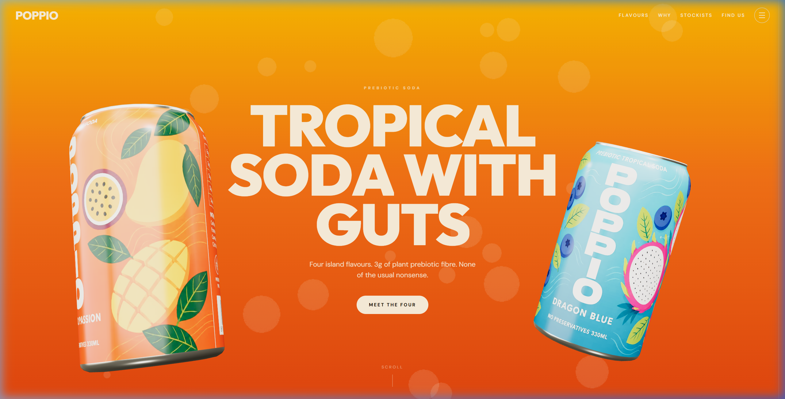
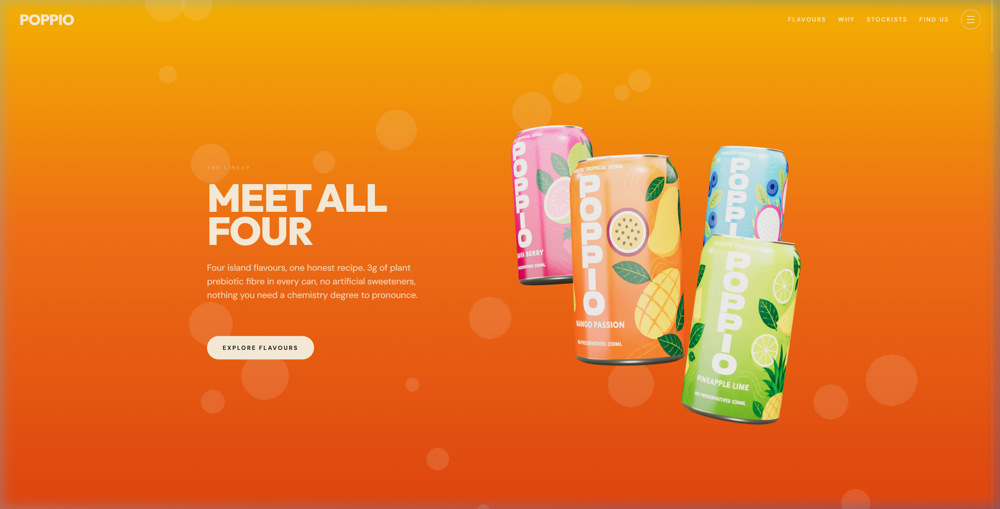
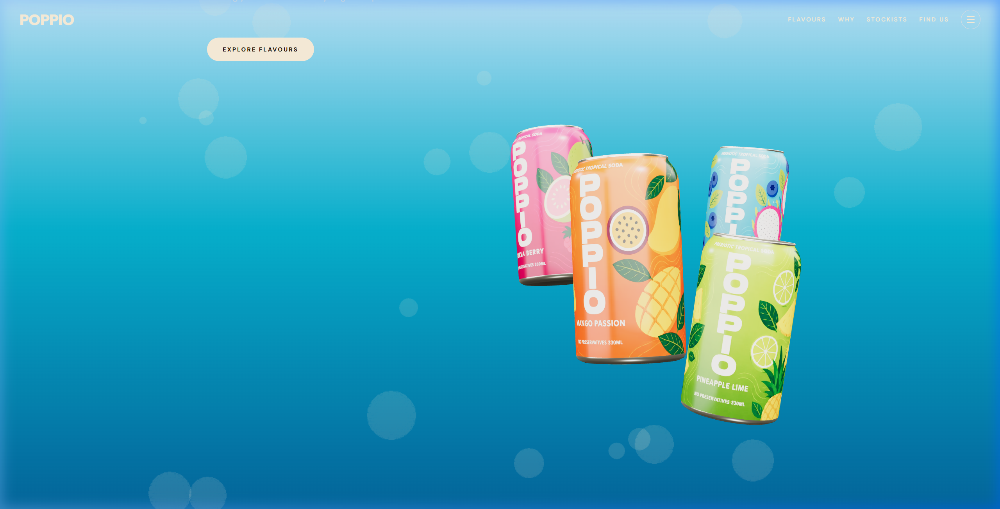
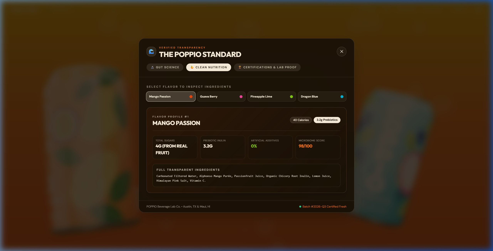

# 🌴 POPPIO — 3D Tropical Prebiotic Soda Website

<p align="center">
  
</p>

<p align="center">
  <strong>An award-winning, interactive 3D WebGL digital experience for POPPIO — Tropical soda with guts.</strong>
</p>

<p align="center">
  <a href="#-overview">Overview</a> •
  <a href="#-key-features">Key Features</a> •
  <a href="#-interactive-sections">Interactive Sections</a> •
  <a href="#-tech-stack">Tech Stack</a> •
  <a href="#-project-structure">Project Structure</a> •
  <a href="#-getting-started">Getting Started</a> •
  <a href="#-performance--optimization">Performance</a>
</p>

---

## ✨ Overview

**POPPIO** is a state-of-the-art interactive 3D landing page and brand experience built with **Next.js 14**, **React Three Fiber (Three.js)**, **GSAP**, and **Lenis**. 

It brings the brand to life with physical 3D soda cans, real-time lighting and reflections, fluid typography, masked SVG liquid wave animations, and seamless scroll-driven choreographies across desktop and mobile devices.

---

## 🚀 Key Features

- **🎮 Real-Time 3D Can Simulation**: Custom GLTF models with dynamic UV label texture mapping, physical materials, realistic metal rim speculars, and ambient studio lighting.
- **🌊 Animated Liquid Logo**: Clean inline SVG wordmark with oscillating sine-wave liquid physics and rising micro-bubbles inside the typography.
- **🔄 Multi-Can Cluster & Seamless Handoff**: Mathematical 3D interpolation from the hero pair to a 4-can cluster, seamlessly handing off the Dragon Blue can into a freefall sky dive without jump cuts or unmounting.
- **☁️ Parallax Skydive Cloud Field**: Multi-layered depth-mapped clouds that wrap seamlessly across scroll coordinates with letter-masked typography.
- **🎨 Interactive 3D Flavour Carousel & Grid**: Custom 3D bottle cards on both desktop and mobile with interactive focus states, real-time label rotations, and color palette transitions.
- **⚡ 60–120 FPS Mobile Optimization**: Adaptive performance tiering, dynamic DPR clamping (1.5 on mobile), touch-multiplier scroll tuning, and frustum-culled WebGL render passes.
- **🧈 Buttery Smooth Inertia Scrolling**: Lenis smooth scroll harmonized with GSAP's requestAnimationFrame ticker and mobile resize stabilizers.

---

## 📸 Visual Showcase & Interactive Sections

### 1. Hero Section — The Dynamic Duo
<p align="center">
  
</p>
*Custom 3D Mango Passion & Dragon Blue cans floating with pointer-reactive lean physics and bold typography.*

---

### 2. Meet All Four — The 4-Can Cluster
<p align="center">
  
</p>
*The duo tumbles and multiplies into all four flavors beside responsive brand copy.*

---

### 3. The Skydive — Atmospheric Aerodynamic Dive
<p align="center">
  
</p>
*Dragon Blue lifts out and tumbles through a procedural rising cloudscape with masked typographic highlights.*

---

### 4. Flavor Showcase & 3D Interactive Grid
<p align="center">
  
</p>
*Explore full nutrition profiles, ingredient notes, and rotating 3D bottles across all 4 tropical flavors.*

---

## 🛠️ Tech Stack

| Category | Technologies |
| :--- | :--- |
| **Framework** | [Next.js 14](https://nextjs.org/) (App Router, Server & Client Components) |
| **Language** | [TypeScript](https://www.typescriptlang.org/) |
| **3D & WebGL** | [Three.js](https://threejs.org/), [React Three Fiber](https://r3f.docs.pmnd.rs/), [@react-three/drei](https://github.com/pmndrs/drei) |
| **Animation** | [GSAP](https://greensock.com/gsap/) (ScrollTrigger, Flip, Observer, useGSAP) |
| **Smooth Scroll** | [Lenis](https://lenis.darkroom.engineering/) |
| **Styling** | [Tailwind CSS](https://tailwindcss.com/), Vanilla CSS Keyframes & SVG Masking |
| **Fonts** | Google Fonts (Outfit, Inter) |

---

## 📁 Project Structure

```bash
poppio/
├── public/
│   ├── fruits/                  # High-res fruit assets
│   ├── screenshots/             # Showcase screenshots for docs
│   ├── wraps/                   # Can wrap textures for 4 flavors
│   └── poppio-can.glb           # Optimized 3D soda can GLTF model
├── src/
│   ├── app/
│   │   ├── globals.css          # Core design tokens, keyframes, liquid animations
│   │   ├── layout.tsx           # Root HTML layout, SEO meta tags, Google Fonts
│   │   └── page.tsx             # Main landing page assembling all sections
│   ├── components/
│   │   ├── Background.tsx       # Dynamic color gradient backdrop
│   │   ├── Nav.tsx              # Navbar with waving liquid SVG logo & responsive links
│   │   ├── SkydiveLayers.tsx    # Parallax cloud layers & letter-reveal typography
│   │   ├── SmoothScroll.tsx     # Lenis smooth-scroll lifecycle & ticker synchronization
│   │   ├── canvas/              # 3D WebGL Scenes & Shaders
│   │   │   ├── Can.tsx          # 3D Can geometry, metallic materials, and label mapping
│   │   │   ├── CanCluster.tsx   # Multi-can hero & lineup poses, handoff interpolation
│   │   │   ├── CarbonationScene.tsx # 3D can with procedural carbonation bubble field
│   │   │   ├── FlavorScrollScene.tsx # Single can with camera dolly & beat spins
│   │   │   ├── Lighting.tsx     # Three-point studio lighting & environmental reflections
│   │   │   ├── PanelStage.tsx   # Interactive 3D bottles for desktop & mobile panels
│   │   │   └── ViewCanvas.tsx   # Global fixed WebGL viewport with performance tiering
│   │   └── sections/            # Web Sections
│   │       ├── Hero.tsx         # Hero section
│   │       ├── MeetAllFour.tsx  # Unpinned lineup transition section
│   │       ├── Skydive.tsx      # Skydive trigger container
│   │       ├── FlavorScroll.tsx # Pinned flavor exploration stage
│   │       ├── Carbonation.tsx  # "Why it works" & prebiotic nutrition stats
│   │       ├── FlavorGrid.tsx   # "Pick a side" interactive 3D flavor panels
│   │       └── Footer.tsx       # Wave-staggered typographic footer
│   └── lib/
│       ├── flavors.ts           # Flavor color palettes, gradients, and metadata
│       ├── pointer.ts           # Mouse/touch velocity and orientation tracking
│       ├── scrollState.ts       # Shared mutable scroll progress refs
│       ├── skydive.ts           # Skydive timeline beat coordinates
│       ├── slam.ts              # Kinetic text slam helper utilities
│       └── usePerfTier.ts       # Mobile & reduced-motion capability hooks
└── tailwind.config.ts           # Custom brand color tokens and theme setup
```

---

## ⚡ Getting Started

### Prerequisites
- **Node.js**: v18.17.0 or higher
- **npm**, **yarn**, or **pnpm**

### Installation

1. **Clone the repository**:
   ```bash
   git clone https://github.com/sanjai1322/Poppio.git
   cd Poppio/poppio
   ```

2. **Install dependencies**:
   ```bash
   npm install
   ```

3. **Start the development server**:
   ```bash
   npm run dev
   ```

4. **Open in browser**:
   Navigate to [http://localhost:3000](http://localhost:3000) to view the live site.

### Production Build

To test the optimized production build:
```bash
npm run build
npm run start
```

---

## 🎯 Performance & Device Support

- **Desktop (macOS / Windows / Linux)**: Full anti-aliased 60fps render with dynamic pointer physics, multi-sample lighting, and hover states.
- **Mobile (iOS Safari / Android Chrome)**:
  - Automatic DPR clamp (`[1, 1.5]`) preventing GPU overload.
  - Adaptive 3D layouts: Cans dynamically reposition below copy on portrait screens.
  - 3D bottle stages enabled across both desktop and mobile views.
- **Reduced Motion**: Gracefully disables cursor tilt, eases camera dollying, and replaces kinetic slams with gentle fades when `prefers-reduced-motion: reduce` is enabled.

---

## 📄 License

MIT License © 2026 POPPIO. Designed and engineered for tropical refreshment.
